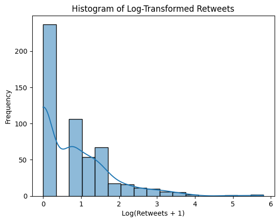

# Twitter Data Analysis: Users, Media, and Places

This project explores a structured dataset of **tweets**, **users**, **media**, and **places**, with the goal of uncovering insights from tweet content, user behavior, and geographical trends. It includes a comprehensive Multiple Linear Regression (MLR) analysis to model tweet engagement based on various numerical features.

---

## Dataset Summary

The dataset includes:
- **Tweet content and metadata**: Text, creation date, language, engagement metrics (likes, retweets, replies, quotes).
- **User details**: User ID, screen name, location, follower count, following count, tweet count, listed count, verification status.
- **Media information**: Media type, image/video dimensions, and preview URLs.
- **Geographic place data**: City, country, and place type.

**Data file**: `tw_tweets_users_media_places-Kwame_Boateng.csv`

**Number of records**: 534

**Key features**:
- Numeric features: `context_annotations_count`, `count_annotations`, `count_cashtags`, `count_hashtags`, `count_mentions`, `count_urls`, `likes`, `quotes`, `referenced_tweet_count`, `replies`, `retweets`, `followers_count`, `following_count`, `tweet_count`, `listed_count`, `height`, `width`
- Non-numeric features: `text`, `created_at_tweet`, `lang`, `location`, `protected`, `verified`, `media_type`, `preview_image_url`, `country`, `name_place`, `place_type`

---

## Project Goals

- **Data Preprocessing**: Clean and preprocess tweet text (removing links, emojis, etc.) and transform numerical features for analysis.
- **Exploratory Data Analysis (EDA)**: Analyze tweet activity over time, user engagement, and geographical trends.
- **Multiple Linear Regression (MLR)**: Model the relationship between tweet engagement (`retweets`) and numerical features, including a log-transformed version of retweets to address skewness.
- **Sentiment and Emotion Analysis**: Explore the sentiment and emotional content of tweets.
- **Visualizations**: Create visualizations for tweet frequency, word clouds, sentiment distributions, and geographical activity.
- **User and Hashtag Trends**: Identify top tweeters, most active cities, and trending hashtags.

---

## Project Structure

```bash
twitter-insights/
├── data/           # Raw and processed data (e.g., tw_tweets_users_media_places-Kwame_Boateng.csv)
├── notebooks/      # Jupyter notebooks for EDA, MLR, and NLP experiments
│   └── Checkpoint_MLR.ipynb  # Notebook with MLR analysis and data preprocessing
├── src/            # Modular Python code for data processing
├── outputs/        # Visualizations (e.g., histograms, word clouds) and analysis results
├── requirements.txt
└── README.md
```

---

## How to Run

1. **Clone the repository**

```bash
git clone https://github.com/yourusername/twitter-insights.git
cd twitter-insights
```

2. **Install dependencies**

```bash
pip install -r requirements.txt
```

Required libraries include:

```text
pandas
numpy
matplotlib
seaborn
wordcloud
nltk
textblob
scikit-learn
statsmodels
```

3. **Launch the main notebook**

Start with: `notebooks/Checkpoint_MLR.ipynb`

This notebook includes:
- Data loading and preprocessing
- Creation of a sample DataFrame
- Selection of numeric features for MLR
- Log-transformation of `retweets` to handle skewness
- MLR model fitting and results summary

---

## Analysis Overview

### Data Preprocessing
- Loaded the dataset with `tweet_id` as the index.
- Created a sample DataFrame with three rows and four columns for demonstration.
- Selected numeric features for MLR analysis, removing non-numeric columns.
- Applied a natural log transformation (`np.log1p`) to the `retweets` column to address extreme skewness, as `ln(0)` is undefined.

### Multiple Linear Regression (MLR)
- **Target Variable**: `retweets_log` (log-transformed retweets)
- **Features**: All numeric columns (`context_annotations_count`, `count_annotations`, `count_cashtags`, `count_hashtags`, `count_mentions`, `count_urls`, `likes`, `quotes`, `referenced_tweet_count`, `replies`, `followers_count`, `following_count`, `tweet_count`, `listed_count`, `height`, `width`)
- **Model**: Ordinary Least Squares (OLS) regression using `statsmodels`
- **Key Findings**:
  - The model was fitted to predict `retweets_log`.
  - Results include R-squared, coefficients, p-values, and confidence intervals.
  - A warning about potential multicollinearity or a singular design matrix was noted, suggesting the need for further feature selection or regularization.

### Visualizations
- **Histogram of Log-Transformed Retweets**: Displays the distribution of `retweets_log` with a kernel density estimate (KDE) to visualize the transformed data's skewness.


---

## Key Visualizations

- **Tweet Frequency Over Time**: Analyze tweet activity patterns using `created_at_tweet`.
- **Word Clouds by Sentiment**: Visualize frequent words in positive, negative, or neutral tweets.
- **Tweet Count by Country**: Show geographical distribution of tweet activity.
- **Top Users and Hashtags**: Identify the most active users and trending hashtags.
- **Histogram of Retweets**: Display the distribution of log-transformed retweets.

---

## Example Use Cases

- **Geographical Insights**: Which cities or countries are most active on Twitter?
- **Engagement Analysis**: What factors (e.g., hashtags, mentions, media) drive retweets?
- **Sentiment Trends**: What’s the general sentiment in tweets, and how does it vary by location or time?
- **User Behavior**: Which users post the most media or have the highest engagement?

---

## Potential Extensions

- **Topic Modeling**: Apply Latent Dirichlet Allocation (LDA) to identify tweet topics.
- **Named Entity Recognition (NER)**: Extract entities like people, organizations, or locations from tweet text.
- **Bot Detection**: Analyze user patterns to identify potential bots.
- **Network Analysis**: Create a graph of user interactions or hashtag co-occurrences.
- **Feature Selection for MLR**: Address multicollinearity by selecting a subset of features or applying regularization (e.g., Ridge regression).

---

## License

Distributed under the MIT License. See `LICENSE` for more info.

---

## Author

**Kwame Boateng**  
*Data Analyst | NLP Enthusiast*

---

## Contributing

If you have suggestions, improvements, or new features to propose, feel free to open an issue or submit a pull request.
